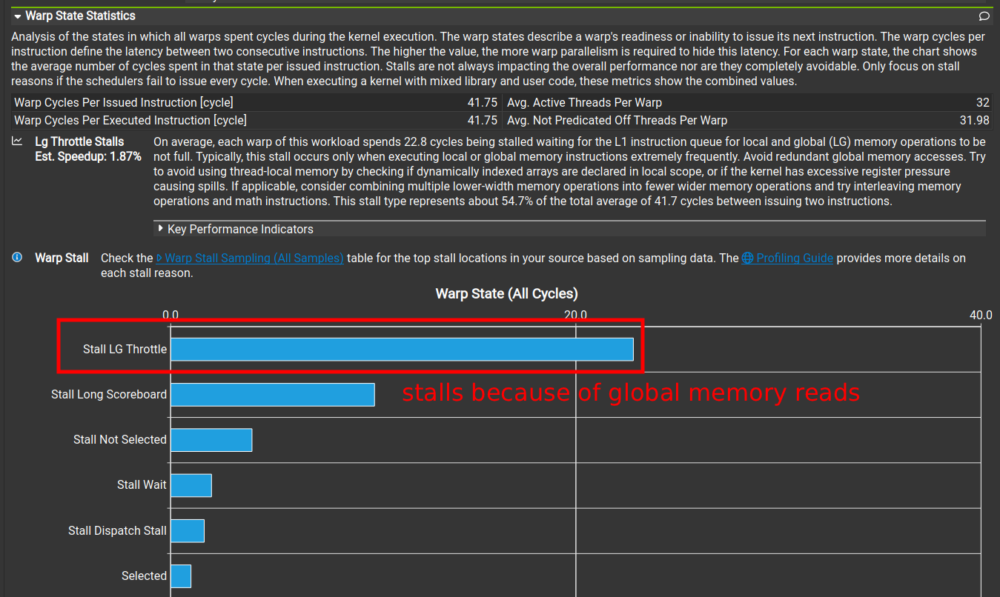
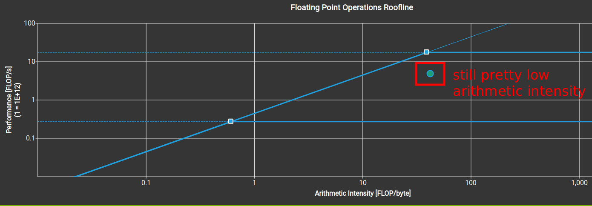

# CUDA GEMM From Scratch

This repository contains several implementations of a general matrix multiplication (GEMM) kernel in CUDA, supporting both single-precision (FP32) and mixed-precision (FP16 inputs, FP32 accumulation) operations.
It starts with a slow naive kernel and applies several optimizations to approach and surpass (at least on my GPU) the performance of NVIDIA's cuBLAS library.

The project is heavily inspired by the following blog posts:

- [How to Optimize a CUDA Matmul Kernel for cuBLAS-like Performance: a Worklog
  ](https://siboehm.com/articles/22/CUDA-MMM) by [Simon Boehm](https://siboehm.com/)
- [How To Write A Fast Matrix Multiplication From Scratch With Tensor Cores](https://alexarmbr.github.io/2024/08/10/How-To-Write-A-Fast-Matrix-Multiplication-From-Scratch-With-Tensor-Cores.html) by [Alex Armbruster](https://alexarmbr.github.io/)

## Hardware Requirements

This project supports mixed precision to leverage tensor cores.
This requires a compatible GPU with compute capability 8.0 or higher.
The code will check your GPU at runtime and produce an error if you attempt to use `--precision fp16` on incompatible hardware.
All fp32 kernels should run on older architectures.

## Building the Project

This repository uses CMake to build the main runner executable.

### 1. Prerequisites

- A C++ compiler (g++, clang++, etc.)
- The NVIDIA CUDA Toolkit (nvcc)
- CMake (version 3.18 or higher)

### 2. Build Steps

Before building, adjust `CMAKE_CUDA_ARCHITECTURES` in [`CMakeLists.txt`](./CMakeLists.txt) to fit your GPU. Then, from the root of the repository, run the following commands:

```bash
mkdir build
cd build
cmake ..
make -j
```

This will compile the project. The executable `gemm_runner` will be located in the `build/` directory.

### 3. Running a Kernel

You can run a specific kernel by passing its ID as a command-line argument:

```bash
# Run the warptiling FP32 kernel (ID 6)
./build/gemm_runner --kernel 6 --precision fp32 --repeats 1000

# Run the FP16 cuBLAS kernel (ID 0)
./build/gemm_runner --kernel 0 --precision fp16 --repeats 1000

# Run the naive WMMA FP16 kernel (ID 7)
./build/gemm_runner --kernel 7 --precision fp16 --repeats 1000
```

## FP32 Performance Overview

Performance for a 2048x2048 FP32 matrix multiplication on an NVIDIA GeForce RTX 3070.

| ID  | Kernel           |    GFLOPS | Performance vs. cuBLAS |
| --- | :--------------- | --------: | :--------------------- |
| 0   | **cuBLAS**       | `~11,613` | 100.0%                 |
| 1   | **Naive**        |  `~1,343` | 11.6%                  |
| 2   | **Tiled**        |  `~1,805` | 15.6%                  |
| 3   | **1D Coarsened** |  `~5,865` | 50.5%                  |
| 4   | **2D Coarsened** | `~10,836` | 93.3%                  |
| 5   | **Transposed**   | `~11,711` | 100.8%                 |
| 6   | **Warptiling**   | `~12,621` | 108.7%                 |

## FP16 Performance Overview

Performance for a 2048x2048 FP16 matrix multiplication on an NVIDIA GeForce RTX 3070.

| ID  | Kernel               |    GFLOPS | Performance vs. cuBLAS |
| --- | :------------------- | --------: | :--------------------- |
| 0   | **cuBLAS**           | `~39,071` | 100.0%                 |
| 7   | **Naive WMMA**       |  `~9,941` | 25.4%                  |
| 8   | **Naive MMA**        |  `~9,450` | 24.2%                  |
| 9   | **Hierarchical MMA** | `~18,153` | 46.5%                  |
| 10  | **Vectorized MMA**   | `~27,625` | 70.4%                  |
| 11  | **Memory swizzling** | `~33,281` | 85.2%                  |
| 12  | **Buffered GMEM**    | `~35,040` | 89.7%                  |
| 13  | **Unrolled SMEM**    | `~36,545` | 93.5%                  |

## Kernel Explanations

### 0: [cuBLAS](./src/kernels/00_cublas.cuh)

Reference implementation created by NVIDIA. Highly optimized, state-of-the-art, extremely performant.

### 1: [Naive](./src/kernels/01_naive.cuh)

Simple matrix multiplication kernel with coalesced memory access where each thread computes one output element. Threads in a warp read the same elements from the first matrix and consecutive elements from the second matrix (`threadIdx.x` is mapped to the columns of the second matrix). This results in memory coalescing.

The kernel suffers from high global memory usage. By profiling in Nsight Compute (NCU), we can see that warps stall mostly due to global memory loads.



### 2: [Tiled](./src/kernels/02_tiled.cuh)

In this kernel, we reduce global memory usage by utilizing shared memory. Each block in this kernel computes an output tile by loading tiles from the input matrices into shared memory and then performing the calculations using the loaded tiles. Global memory access is still coalesced for threads in a warp and each thread computes one output element.

Compared to the previous kernel, performance increases by ~33%. Using tiled algorithms can traditionally lead to even larger performance gains, however, the previous kernel had a high L1 cache hit rate of close to 90%. More performance gains can be found by increasing arithmetic intensity since the kernel is memory bound.


### 3: [1D Coarsened](./src/kernels/03_1D_coarsened.cuh)

This kernel increases the work per thread. Each thread is now responsible for computing a `TM x 1` vertical slice of the output tile. This improves arithmetic intensity. The kernel also uses a 1D thread block and uses several mappings to map the threads to various 2D tiles, e.g. to load values into the shared memory. The implementation details, parameter constraints, and indexing logic can be found in the source file.

Compared to the previous kernel, performance increases by ~225%. While this kernel is now compute bound in NCU, its arithmetic intensity is only slightly past the ridge point, so increasing it further can still yield significant performance gains.



### 4: [2D Coarsened](./src/kernels/04_2D_coarsened.cuh)

In this kernel, each thread computes a "minitile" of size `TM x TN`, which increases the work per thread and arithmetic intensity. Many more details can be found in the source file.

Compared to the previous kernel, performance increases by ~85%. However, this optimization introduced a few new problems. Each thread now loads a `TM x 1` vertical slice from the A tile and this access isn't ideal. Furthermore, since each thread now stores a full `TM x TN` minitile, the global memory writes are no longer coalesced.


### 5: [Transposed](./src/kernels/05_transposed.cuh)

This kernel uses a transposed A tile to make data loading from shared memory into registers more efficient. It also vectorizes all global memory reads and writes.

Compared to the previous kernel, performance increases by ~8%. Using transposed A tile results in vectorized shared memory reads but it initially introduced a new problem: the shared memory writes weren't coalesced and there were a lot more bank conflicts. This was resolved resolved by making threads load and write chunks of 4 elements. Finally, the global memory access vectorization alleviated the inefficient write problem.

Since bank conflicts still remain, we could try to improve performance by reducing the access inefficiencies even more, but there is a more traditional optimization to implement.


### 6: [Warptiling](./src/kernels/06_warptiling.cuh)

In this kernel, one warp computes one "warptile" in several iterations. A lot more details can be found in the source file.

Compared to the previous kernel, performance increases by another ~8%, which is quite a lot given the previous kernel already outperformed cuBLAS on my GPU. Intuitively, using warptiling adds another level of parallelism. After careful tuning, this gets rid of all shared memory load bank conflicts by ensuring that all threads within a single warp access different memory banks.


This image displays the roofline model with the cuBLAS kernel and all 6 custom kernels:


### 7: [Naive WMMA](./src/kernels/07_naive_wmma.cuh)

This is the first custom kernel which uses tensor cores and mixed precision (FP16 + FP32). It is programmed using the WMMA (warp matrix multiply accumulate) API. In this kernel, blocks consist of 1 warp and each warp computes a `16 x 16` tile of the output matrix. Despite the simple implenetation, it achieves almost 10 TFLOPS, a significant speedup over the naive FP32 kernel and approaches both the FP32 cuBLAS and warptiling kernels.

### 8: [Naive MMA](./src/kernels/08_naive_mma.cuh)

This kernel uses low-level PTX instructions instead of the WMMA API. It is based on the `mma.sync.aligned.m16n8k8` instruction and uses `ldmatrix` to load values from shared memory into registers. Blocks again consist of 1 warp so one blocktile is effective one warptile but this kernel supports arbitrary block sizes as long as they are compatible with the MMA size (16x8x8). Using raw PTX instructions give us a lot more control and this kernel is a middle step between the high-level WMMA kernel and the more optimized kernels.

### 9: [Hierarchical MMA](./src/kernels/09_hierarchical_mma.cuh)

This kernel implements the full tiling hierarchy. Blocktiles consist of warptiles and each tiling level has a configurable size. Registers are reused across the iterations on the innermost loop which keeps the tensor cores more satiated. After doing some basic finetuning, this kernel runs almost 100% faster than the previous one and at almost 50% of cuBLAS speed without any sophisticated optimizations.

### 10: [Vectorized MMA](./src/kernels/10_vectorized_mma.cuh)

This kernel uses vectorized 128-bit loads for loading values from global memory into shared memory for the A and B tiles. This simple change results in a massive performance boost and the kernel is slowly starting to approach cuBLAS performance on my GPU.

### 11: [Memory swizzling](./src/kernels/11_memory_swizzling.cuh)

This kernel uses memory swizzling to get rid of all bank conflicts when loading values from shared memory into registers. The loops are also slightly refactored for efficiency and the kernel uses shared memory offsets for the `ldmatrix` instructions instead of a generic address pointer which makes it even faster. After implementing memory swizzling, I adjusted tile sizes because it resulted in better performance. In fact, the grid size for this kernel now matches the grid size for the cuBLAS kernel.

### 12: [Buffered GMEM](./src/kernels/12_buffered_gmem.cuh)

This kernel uses a buffer to load values from global memory to shared memory. It loads the necessary values for the first tile outside the main loop. At the beginning of the loop, it initiates the global memory loads and only stores the value into shared memory after the main computation. This allows the computation to overlap with global memory loads. Surprisingly, on my GPU, this kernel is faster with modified `BK` and `WK` values, both of them equal to 32. Note that this results in shared memory usage which is very similar to the cuBLAS kernel.

### 13: [Unrolled SMEM](./src/kernels/13_unrolled_smem.cuh)

This kernel uses manually unrolled functions (`load_a_from_smem` and `load_b_from_smem`) to load values from shared memory into registers. This allows us to significantly reduce the number of instructions resulting in a noticeable speedup. Compared to the previous kernel, the total number of executed instructions decreases by about 50% and is now comparable to the number of instructions executed by the cuBLAS kernel.

## License

This project is licensed under the MIT License.
